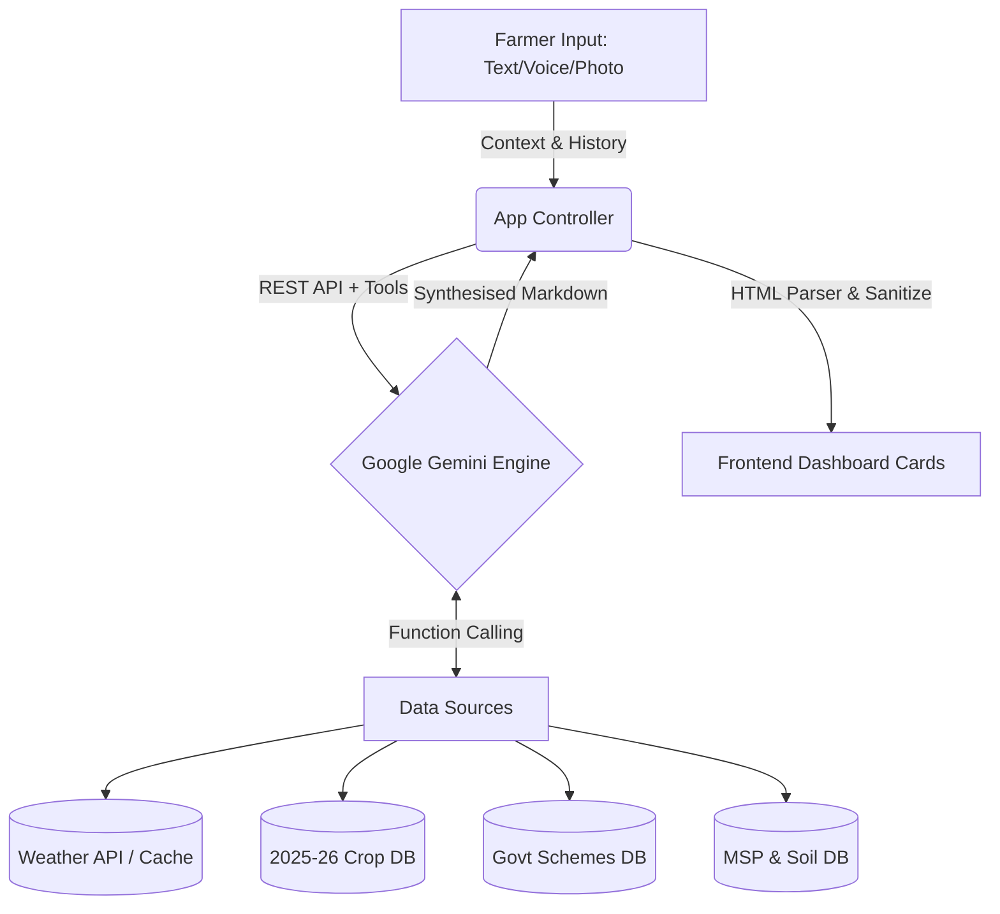

<div align="center">
  <h1>🌾 Farmer Decision Engine</h1>
  <p><strong>From soil to strategy — one conversation.</strong></p>
  <p>An AI-powered agricultural decision engine that helps Indian farmers make optimal farming decisions by synthesising disparate datasets into actionable, localized advice.</p>
</div>

---

## 📖 Overview

Most farming decisions require synthesising information from disconnected systems — weather forecasts, soil health, government Minimum Support Prices (MSP), scheme eligibility, and crop science. A farmer currently has to navigate all of these alone. 

The **Farmer Decision Engine** lets a farmer describe their land, crop, and problem in natural language natively, and the engine handles the synthesis. Powered by **Google Gemini**, the system autonomously queries live data and embedded agricultural databases to recommend a specific, highly tailored action plan.

## ✨ Core Features

1. 🧠 **Gemini-Powered Intelligence**
   - Natural language understanding combined with autonomous multi-step **function calling**.
   - The AI identifies what data it needs, triggers the appropriate tools, and synthesises the results into structured, color-coded advisory cards.
2. 🌍 **Instant Multilingual Translation (Google Services)**
   - Integrated **Google Translate Widget** instantly translates the interface and all generative AI responses into Hindi, Punjabi, Marathi, Tamil, Bengali, and other regional languages.
3. 🌤️ **Live Weather Analysis**
   - Fetches real-time weather via OpenWeatherMap (or simulated seasonal data) and provides farming-specific advisories (e.g., "Delay sowing due to frost risk"). Uses an **in-memory LRU cache** to ensure efficiency and limit API calls.
4. 💰 **Market Intelligence**
   - Contains real 2025-26 MSP prices and calculates simulated Mandi prices. Advises whether to sell locally or at government procurement centers.
5. 🏛️ **Government Scheme Eligibility**
   - Cross-references the farmer's land size and state with schemes like PM-KISAN, PMFBY, e-NAM, and KCC to automatically calculate eligibility and potential benefits.
6. 🌱 **Crop & Soil Science**
   - Provides scientific sowing windows, water needs, fertilizers, and pest management (with exact chemical dosages) for over 10 major Indian crops matched to state-specific soil profiles.
7. 🎤 **Multimodal Inputs**
   - **Voice Input:** Speak questions directly using the native Web Speech API.
   - **Vision / Photo Upload:** Upload photos of diseased crops for instant visual diagnosis via Gemini Vision.
8. ♿ **High-Quality UX & Accessibility**
   - Built with an earth-toned, glassmorphism design system. Fully mobile-responsive.
   - **Accessibility (a11y):** Screen-reader compliant with ARIA-live regions, ARIA labels, and semantic HTML.
   - **Security:** Hardened with strict HTML sanitization and Content Security Policy (CSP) headers.

---

## 🏗️ Architecture

The Farmer Decision Engine operates on a **Retrieval-Augmented Generation (RAG) + Agentic Tool Calling** architecture, deployed entirely as a low-latency static web application on **Google Cloud Platform (App Engine)**.

### System Flow
1. **Context Aggregation:** The UI collects the explicit user query, uploaded images, and the implicit farmer profile (state, crops, land size).
2. **Intent Parsing (Gemini):** The request is sent to `gemini-2.5-flash` via the REST API equipped with strict system instructions and predefined Tool Declarations.
3. **Autonomous Tool Execution:** 
   - Gemini decides which data sources it needs (e.g., calling `getWeather` and `getSchemeEligibility`).
   - The browser securely executes these local/remote functions and returns the JSON payload back to the AI.
4. **Synthesis & Formatting:** The AI synthesises the raw data into Markdown, which the App Controller parses in real-time into a progressive UI consisting of structured dashboard cards (Target Action, Weather, Market, etc.).



---

## 🚀 Getting Started (Local Development)

### Prerequisites
- A modern web browser.
- A free Google Gemini API Key.

### Installation
1. Clone the repository.
   ```bash
   git clone https://github.com/sachin0612/promptwars_google.git
   cd promptwars_google
   ```
2. Run a local web server (e.g., Python's built-in server).
   ```bash
   python -m http.server 8080
   ```
3. Open `http://localhost:8080` in your browser.
4. Enter your Gemini API key when prompted and start asking questions!

## 🧪 Testing

The repository includes a self-diagnostic test suite to ensure the data layer and tool structures remain intact.
- Navigate to `http://localhost:8080/tests/run_tests.html` in your browser to execute the unit tests.

## ☁️ Deployment

This project is configured for seamless deployment to **Google App Engine**.
```bash
gcloud app deploy app.yaml --quiet
```
*Note: `default_expiration: "0s"` is set in `app.yaml` to prevent aggressive edge caching, ensuring farmers always receive the latest advisory updates instantly.*

## 🛠️ Tech Stack

- **Frontend Core**: Vanilla HTML5, CSS3, JavaScript (ES6+). Zero bloat.
- **AI Brain**: Google `gemini-2.5-flash`
- **Translation Engine**: Google Translate API
- **Live Data**: OpenWeatherMap API
- **Deployment & Hosting**: Google Cloud Platform (App Engine)
